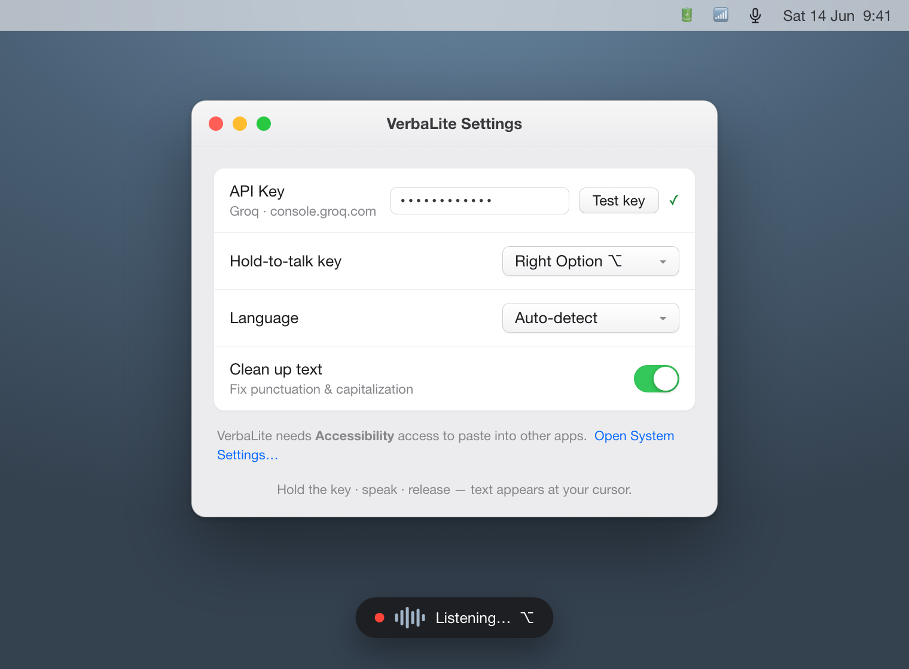

# VerbaLite

**A tiny menu-bar voice dictation app for macOS. Free.**

Hold a key, speak, release — the recognised text is typed wherever your cursor
is. It lives in the menu bar: no Dock icon, no main window, no account.
You bring your own API key, and the audio goes straight to the recognition
service — there is no server of ours in between.

  

## Download

Get `VerbaLite.zip` from the [latest release](https://github.com/karpovantonme/verbalite/releases/latest),
unzip it, and drag `VerbaLite.app` into `/Applications`.

The build is **ad-hoc signed** — there is no Apple Developer certificate behind
it, so Gatekeeper will not open it on a double-click. To run it the first time:

**right-click the app → Open → Open**

macOS remembers the choice, so this is a one-time step.

## What it does

- Hold-to-talk on a key of your choosing
- Speech recognition via Groq Whisper (`whisper-large-v3-turbo`)
- Optional cleanup pass that fixes punctuation and obvious slips
- Automatic language detection — dozens of languages out of the box
- Universal binary: Apple Silicon and Intel

## Privacy

VerbaLite has no servers. Audio and text leave your Mac **only** for the
endpoint you configure yourself. Your API key is stored in the macOS keychain.
No telemetry, no analytics, no accounts.

## Requirements

macOS 13 or later, and a free Groq API key from
[console.groq.com](https://console.groq.com).

## Looking for more?

VerbaLite is the small free one. **[Verba](https://github.com/karpovantonme/verba)**
is the full version — cleanup levels, dictation history, snippets, a learning
vocabulary, six interface languages and automatic updates.

---

Made with care by **Anton Karpov** · [karpovanton.me](https://karpovanton.me)

